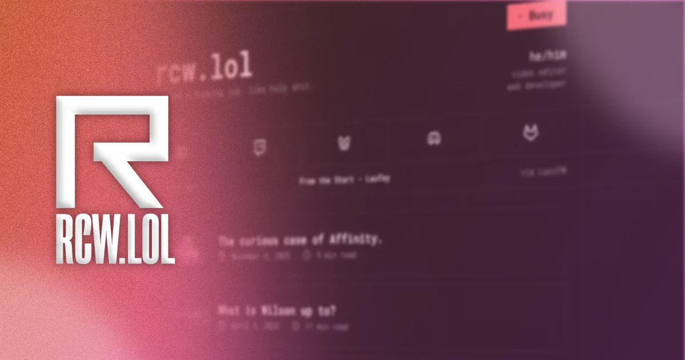

<div align="center">


# My Website
My personal website, made with Astro.

</div>

## About this repo.

This is the source code for my website, originally derived from the [astro-erudite](https://github.com/jktrn/astro-erudite) template. It has been pretty heavily modified to fit it's own aesthetic and for my own purposes, and is practically a completely different project at this point.

As of **4.0**, I toned down and minimalized the website significantly while still keeping a lot of the content that I want to include. I wanted to better highlight a lot of the projects that I'm working on instead of creating a landing page of widgets.

## How do I modify this?

This project is open source and available under the [MIT License](LICENSE) - modify and shape it to be yours!

However, I will not be providing support for forks of the project, as the license suggests, this project is as-is. But, if there is a bug, please report it and I will do my best to attend to it.

That being said, if you still want to work on it - development is super easy. Follow these steps:

```sh
# Clone the repo
git clone https://gitlab.com/rcw.lol/website

# Install dependencies
cd website && bun install

# Run the test server
bun dev
```
