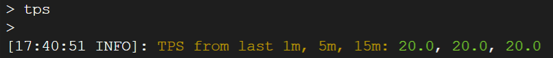
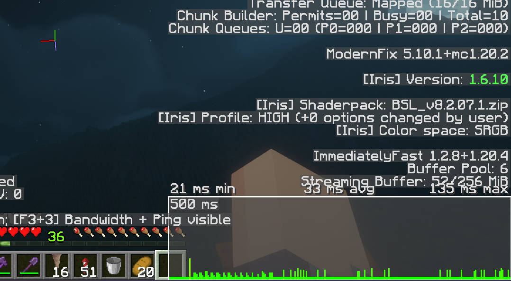

As you may or may not know, I have been operating a small community Minecraft server. All in all, it's been a very fun experience to play and manage. However, this did not come without its own set of issues. Most notably, a reoccurring issue we had was fairly consistent lagging or stuttering when a number of players are on the server.

There a few key points to discussing lag. On the client side, it's either your computer hardware, or your network connection. On the server side, it's either the server's hardware, or the server's network connection. Simplified - obviously, but generally, this is how it boils down for online games.

In this article, I will discuss some of the issues that come with server hosting and how we mitigated these problems.

## The Hardware Bottleneck
One of the quickest ways to check whether the client or the server is lagging, is to check the **ticks per second (TPS)** reported by your server. A "tick" is a measure of Minecraft's internal clock. This controls the scheduling and updating of various events, like block placements, synced movements, redstone, etc. Essentially, the game should always run at a tick rate of **20 TPS**. This indicates that the game is running at the pace it is intended, and the server is able to keep up with all of the clients.

On most servers, if you have permission, you can check the current tick rate and past tick rates using the `/tps` command from either in-game or via the server console. This will display the tick rate from the past minute, past 5 minutes, and past 20 minutes, respectively.



If the tick rate ever drops **below 20**, it is a good indicator that the server itself is running behind, and it isn't a network or client side issue.

In the case of our server, I noticed that during periods of high usage, the TPS would start to fall behind, with values as low as **17** or **15 TPS**. So, I decided to check the management panel of the server host that I used, Shockbyte. Surely enough, the panel indicated that the server didn't have enough RAM as it was constantly pinned at almost **100% usage!**


This means, we needed to upgrade the server. However, this brought its own set of issues.

## The Server Host Dilemma
As I previously mentioned, the server host that I initially picked was [Shockbyte](https://shockbyte.com). I had used them in the past for an even smaller Minecraft server, so I thought it may be a good pick for this one as well.

In my infinite wisdom, I decided to pay for the plan I picked using PayPal. I *generally* don't like to give a bunch of services my payment information, so I like to use PayPal when possible when shopping online.

As it turns out, Shockbyte, while accepting PayPal as a payment method, apparently comes with its own downsides. You cannot upgrade the server plan without paying for the invoice of the next month. Which is fine in and of itself, however because PayPal was used as the payment method, you cannot pay in advance and have to wait for the billing cycle to end.

This was already infuriating enough that I decided to swap server hosts. But, once again, as it turns out, this would be even more of a pain in the ass than I originally thought.

A quick Google search for `"best minecraft server hosts"` or even appending `"reddit"` would leave you deep in a rabbit hole of marketing schemes and scummy advertisements. For example, check out this [Reddit post](https://www.reddit.com/r/GameServerHosting101/comments/15t0kji/best_minecraft_server_hosting_service_according/). On the surface, you might see some recommendations for server hosts that you may want to use, but another second of investigation work and you'll see that almost every single one of these replies is a bot.

Do any of these names have something in common to you?

* grudgingWigeon901
* Typical_Drink_4017
* immerse_wealthy78
* crushedDinosaur98039
* unhappySeahorse67612
* amazedLapwing1734

So on, so fourth? Yeah - **they're all bots**. Even the account that posted the question, **IS A BOT**. This makes finding an actually decent server host that people *actually* recommend a very hard task to accomplish. And if you're one of the hosts that is creating and pushing out bots to promote your shitty host, **shame on you**.

So I took the initiative to host it myself.

## The Network Bottleneck
While the transition to self hosting wasn't a road of rainbows and flowers, I eventually got it working via a reverse proxy and a VPN with port forwarding support (connected via IKEv2). A new self hosted version of the server was running, with double the RAM that was previously allocated with our prior server host.

Of course, as you might come to expect, we ran into further lag problems even after switching hosts. This time, the lag was different. The server reported the tick rate as being a steady and stable 20 TPS. So, the server itself isn't falling behind... what was the problem?

It was happening to everyone at once, so it had to be something that *would* effect everyone, and with the server itself still operating normally, the only option left was a networking issue on the server side.

Just to confirm, I decided to check Minecraft's built-in debug screen for anything that would indicate a network bottleneck. When you combine the keys `F3+3` you will see two graphs open at the bottom of the screen. This is Minecraft's bandwidth profiler. This is used to provide information on the amount of data being sent and received between the game client and the server.



Surely enough, every single time one of these lag spikes happened, a very large red bar would appear with a high response time reported. This indicates that the network on the server was bottlenecking every player.

After some research, it turns out that the VPN protocol that I had been using, `IKEv2`, had latency issues. And what I **should've** been using is `WireGuard` - the latest and greatest protocol apparently. I'm going to be honest, I have no idea what the difference between all of the VPN protocols are, but I tried WireGuard.

And it worked! The lag problems had gone away! Or so I thought...

## The Storage Bottleneck
This one was a little easier to detect, thanks to the power of Google searches and online forums. At this point, almost all forms of lag spikes had been mitigated. But in some rare instances, when lots of people were online, there would be a **VERRRY** long lag spike.

What could be the cause of this? I had fixed the network issues, I had allocated double the RAM, what could it possibly be?

Back to the investigation room, where I noticed an incredibly large error in red font being displayed in the console (or logs). I'm not going to include this in it's entirety, but you can view what the entire error looked like [here](https://gist.github.com/rcwdev/2e9008d2b958de56e1712dd96a1ded71).

```text
--- DO NOT REPORT THIS TO PAPER - THIS IS NOT A BUG OR A CRASH  - git-Paper-318 (MC: 1.20.2) ---
The server has not responded for 10 seconds! Creating thread dump
------------------------------
Server thread dump (Look for plugins here before reporting to Paper!):
Ticking entity: minecraft:player, entity class: net.minecraft.server.level.EntityPlayer
Entity status: removed: false, valid: true, alive: true, is passenger: false
Entity UUID: 78139f14-7aa0-4215-b27d-46e0a63a7cb6
Position: world: 'world' at location (-6506.487500011921, 39.0, 2190.550653779265)
Velocity: (0.0, -0.0784000015258789, 0.0) (in blocks per tick)
Entity AABB: AABB[-6506.787500023842, 39.0, 2190.250653767344] -> [-6506.1875, 40.799999952316284, 2190.850653791186]
Total packets processed on the main thread for all players: 4506986
------------------------------
```

After some very vigorous internet searches, I found out the culprit of this problem.

**I had the server running on a hard drive.**

That's it. That was the problem I had. After moving the server to an SSD, I haven't got this error since.


## So, In Conclusion...
Running a Minecraft server can be very fun. You get to customize, mix and match plugins, explore different worlds and have fun with your friends or family in a game about doing whatever you want. But sometimes, you can run into problems, and identifying those problems can be a huge pain in the ass. So yeah. That's how I migrated and mitigated the lag issues of Lt. Wilscraft!