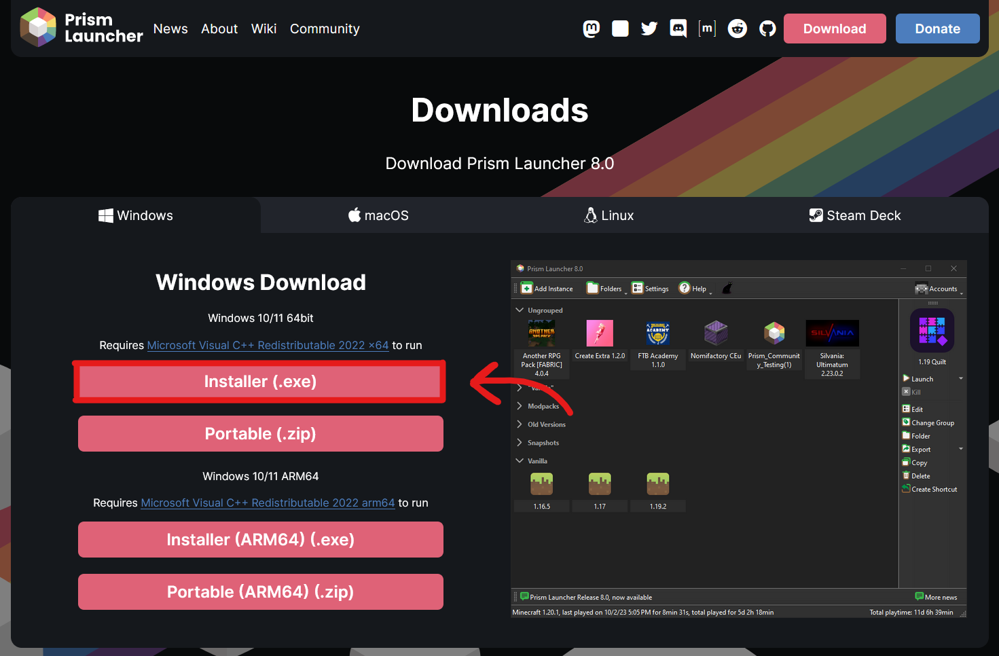

Ready to join the Lt. Wilscraft server? Let's get you setup with the proximity voice chat mod and other performance mods to help you join the server easily.

## What is Prism Launcher?
[Prism Launcher](https://prismlauncher.org) is an open source Minecraft launcher based on [MultiMC](https://multimc.org). The project prides itself in it's ability to manage various different instances, accounts, and mods for the game.

For instance, the launcher has built in integrations with platforms like Modrinth or CurseForge. This allows you to quickly download resource packs, shader packs or mods directly from these sources, without having to scour the internet and manage a mod folder manually.

I'm sure you can see how this would be useful, especially with their import feature that will we be using for this guide.

## Installing Java
First and foremost, you'll need Java in order to run Minecraft, regardless of whether you plan to use Prism Launcher or the regular launcher. The server runs on Minecraft version `1.20.2`, which requires Java 17.

**If you don't have Java**, head over to the Adoptium [download page](https://adoptium.net/temurin/releases/?os=windows&arch=x64&version=17), and hit the download button on the latest version of Java 17. See the picture below if you need help.

Once you have it downloaded, run through the installer like normal.

## Installing Prism Launcher

### Prerequestites
* You will need to own a copy of Minecraft: Java Edition.
* You will need to install [Microsoft Visual C++ Redistributables](https://aka.ms/vs/17/release/vc_redist.x64.exe) if you don't already have them.

### Installing the Launcher
You can download the latest version by heading to their [download page here](https://prismlauncher.org/download/) and selecting the 64bit installer. See the picture below if you need help.

Then, of course, run through the installer like normal once you have it downloaded.

## Setting It All Up

> ℹ️  A video tutorial for this section is available [here](https://www.youtube.com/watch?v=Z6MPMh1kTvE)!

Once you have Prism Launcher installed, all we need to do is add the Microsoft account that owns your copy of Minecraft to the launcher, and import the modpack!

You will likely see a window displaying installed versions of Java the first time you open the launcher. You can simply press `Finish` to skip this!

### Logging In
Follow these steps to add your account:

1. Click on the `Accounts` button in the top right corner of the main window.
2. A dropdown menu should open, click `Manage Accounts...`
3. Once the settings dialog opens, click the `Add Microsoft` button near the top right corner of the window.
4. A popup window should open with a button that says `Open page and copy code`, go ahead and click on it. This will copy a code that you'll need to paste into the Microsoft login screen that opens in your internet browser.
5. Paste the code, then login with your Microsoft account.

After that, your account should be added to the launcher!

### Adding the Modpack
Now that you have your account added to the launcher, all that's left is adding the modpack itself! Which is very easy.

1. On the main window, click the `Add Instance` button in the top left corner.
2. In the window that opens, click the `Import` button in the list of sources.
3. Paste the following URL `https://rcwdev.s-ul.eu/tHEGXsMo` then click OK.

Once you've done that, it'll go ahead and download all the mods for you and put the server into your Minecraft server list automatically.

That's it! You should now be ready to play on Lt. Wilscraft!