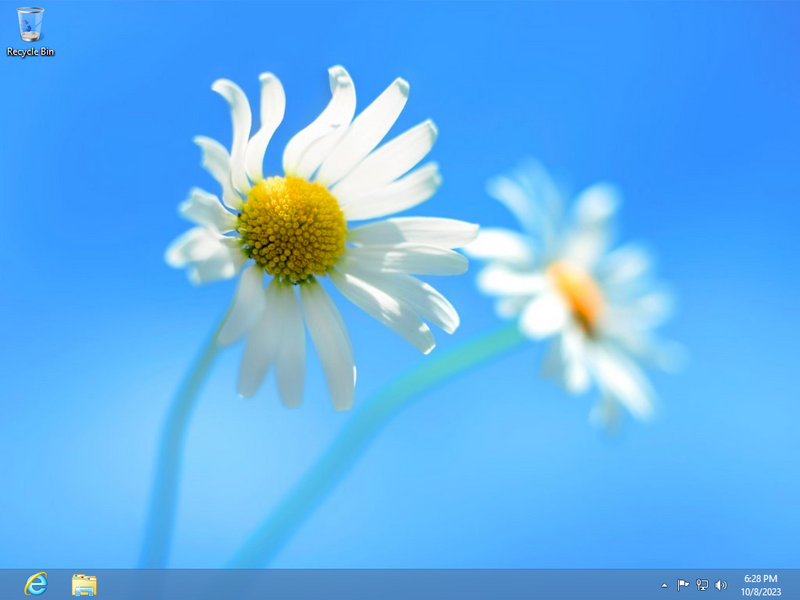
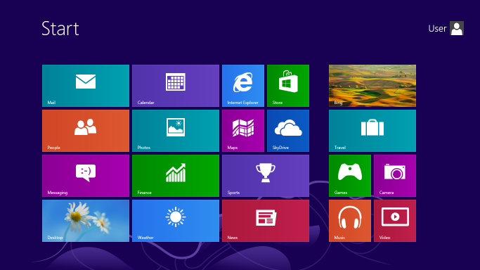
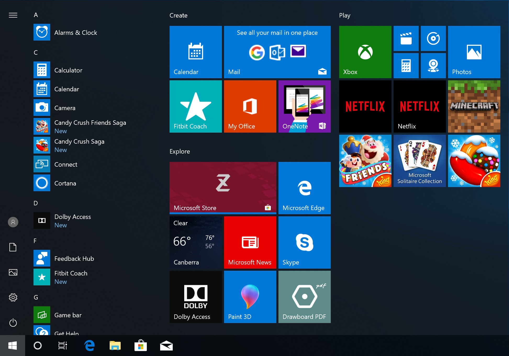
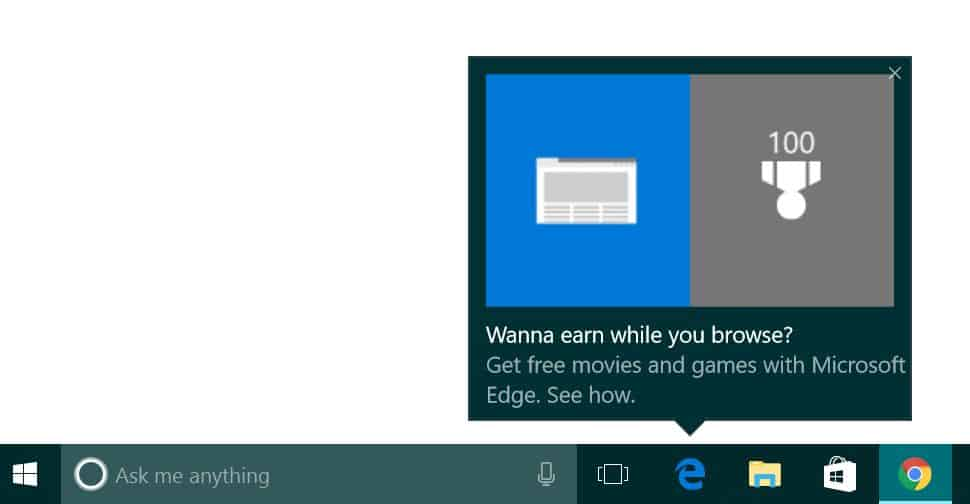
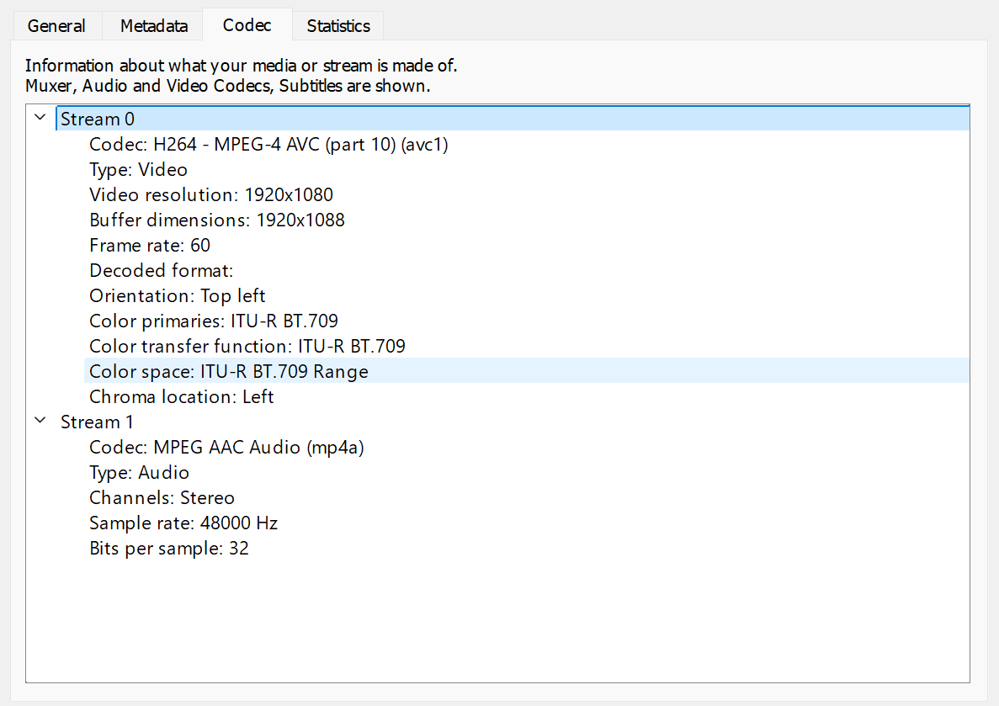

As of the time of writing this, Windows still dominates charts for being the most used desktop operating system worldwide, at a staggering 71% according to [statcounter](https://gs.statcounter.com/os-market-share/desktop/worldwide).

But, you may have noticed over the past couple of years, more and more people have complained about how awful Windows has become. *Not that Windows necessarily has a good track record with operating systems*. Generally speaking, the last good operating system that everyone seems to universally like, was Windows 7.

## 🤔 But what exactly do people not like about Windows?

Before we even touch base on Linux, I think that it's important to highlight some of the gripes and frustrations that people have with modern Windows. While for some people this journey may actually begin with Windows ME, for most people, this journey obviously begins with the disaster of a launch that was Windows 8.

### The disaster that was Windows 8.

Windows, since it's creation has always been a desktop-first oriented operating system. From the days of Windows being built on top of DOS, to the glory days of XP. It had always been designed for a computer or laptop and the control schemes that they provide. You could occasionally find a computer with a touch screen, but it was almost always a lackluster experience and lacked behind just using a simple keyboard and mouse.

And with Windows 8, they decided to go all-in on a touch-screen first interface. Do you remember how bad Windows 8 was on launch?

|Windows 8 Desktop|Windows 8 Start Menu|
|---|---|
|||

Microsoft had entirely removed their own brand identity by removing the start menu in the taskbar (which they added back in 8.1), in favor of a new full-screen start menu. Which yes, if you were using a touch screen enabled device, was a better experience than the cramped start menu, but it also entirely neglected desktop users and required them to take their attention away from their work, and try to navigate this new menu that takes up the entirety of the screen.

Microsoft also heavily tried to push their new Windows Store and UWP (Universal Windows Platform) apps. Which were clunky and also took up the entirety of the screen, just like the start menu. Not to mention how much junk ended up on the Windows Store. You always had to end up searching for the program you're looking for on the web rather than using the store.

Windows 8 was a failure, and even their much better, but still bad counterpart, Windows 8.1, still only amassed to a max of 9% and 19% market share respectively, with Windows 7 still being largely used during it's life.

### Telemetry, tracking, and ads.

With the introduction of Windows 10, which was far more well received in terms of desktop usability, it introduced a bunch of problems that would indicate the direction Microsoft wanted to go in.

When you went to install Windows 10, their out-of-box experience (OOBE) introduced a bunch of options that were opt-out instead of opt-in for tracking, and other telemetry. Which, for a lot of people, is fine. While telemetry for developers is very important to help identify problems and address them with information, for some people, this seemed like Microsoft was violating their privacy.

At least you were prompted for these options, unlike how when you finally reached the desktop, you may notice that you have a bunch of stuff preinstalled, like Candy Crush Saga? Yeah. This is when Microsoft started to introduce their bundled bloatware and their dreaded push for everyone to use their beloved Microsoft Edge web browser.

|Start Menu Ads|Microsoft Edge Nagging|
|---|---|
|||

The search in Windows 10 was awful, and for whatever reason prioritized websites over the apps, files, and settings of the actual operating system. Which made it awful to use. And don't worry, it only gets worse with Windows 11!

### And then there's Windows 11.

Windows 11 released with very little market share because people couldn't actually run it. With the introduction of Windows 11, Microsoft introduced new hardware restrictions so that if you were running a CPU that was too old, or didn't have a TPM 2.0 chip on your motherboard. This caused a lot of people to stick with Windows 10, and they have almost definitely stayed there.

Do you remember how wonderful the ads for Microsoft Edge in Windows 10 were? Well, guess what? For our brand new operating system, we've made it even harder to change your default browser, and we'll even ignore whatever your default browser is if you're using a Microsoft app!

Yeah, that's right. Windows 11 removed the option to easily change your default browser, and instead required you to manually change default apps by associating file types. As it turns out, a web browser handles a lot of file types, and made changing browsers within Windows 11 an absolute damn nightmare. And, to add the cherry on top of the cake, any search that you made within the built-in Windows 11 search bar, or even links in most Microsoft apps, would intentionally ignore whatever browser you set, and just directly open Microsoft Edge.

And here's the kicker! You can't uninstall it!

Oh, and you have to **have** a Microsoft account in order to finish setting up your computer. Local accounts? What are those?

### More privacy concerns...

Microsoft also decided to introduce a new feature to Windows 11, and eventually Windows 10 called Windows Copilot. And while it was boasted as being the “future of computing” - it was simply a web app that was preinstalled and always running on your computer that essentially gave you the same LLM (Large Language Model) services that you could run in an internet browser like ChatGPT.

Think that's everything? Along with the privacy concerns of just what information was being provided to Windows' brand new Copilot feature, they also announced a feature called “Recall” which would take a screenshot every 5 seconds and analyze each screenshot so that it could be indexed and searched for. In theory, this could be helpful to just be able to search anything that you've ever done on your computer, like figuring out what guide you looked at a couple of months ago.

But in reality, it ended up being a massive security nightmare that wasn't even being encrypted what-so-ever, so it would make Windows a very valuable platform for hackers to target, since they could just silently steal all of your Recall data without you ever knowing.

## 🐧 Well, if it's so bad, why don't people just switch to Linux?

Linux has always been boasted in the comments of posts, articles, videos of people complaining about Windows. “Just switch to Linux, then.” is a phrase that you will eventually begin to hear a lot.

But is it really that easy? Can you just swap out Windows for Linux on any computer? Well. It depends what you're using your computer for, and how much research you're willing to commit.

### Why are there so many options?

I wouldn't blame for you immediately giving up after doing a quick Google search for “linux download” and being greeted with so many different options of distributions to download. Ubuntu? Debian? Fedora? Arch? I just wanted to try the Linux thing that people have been telling me to download. What are all of these things? What the hell is a CentOS? I thought I was downloading Linux!

This is very confusing for the average person who has never dared venture outside of the operating system that came preinstalled with their computer. This alone is enough of a deterrent for most people. But, still. Let's assume people can figure out what distro they want to use.

Now, I should let it be known that your distribution often does not matter. The primary things that sets distributions apart is how they package the apps that you use, how often those apps are updated, and how they nail and string everything else together to make a functioning system. For example, Ubuntu uses the GNOME desktop along with the apt package manager. Whereas Fedora also uses the GNOME desktop, but instead uses the dnf package manager.

You name any part of the system, there is almost always an alternative way to do it. You want a different login screen? Ok! You want a different way to start services? Ok! You want a different style desktop? Ok! You want a different package manager entirely? With enough know-how, ok!

### It *can* work for some people...

Like I said previously, depending on what you use a computer for, Linux can absolutely work for you. Assuming you picked a very commonly used distribution like Ubuntu or Linux Mint and everything that you do is in a web browser, there is a fairly large chance that it will work perfect for you, fresh out of the box. Even on an pretty old computer. You got an old MacBook that doesn't get updates anymore? Throw Linux on it and you'll probably have a fairly decent experience and stretch more life out of an outdated device.

As a matter of fact, that's a very common use case for Linux, because of it's (generally) far lighter system requirements compared to Windows. Like I mentioned before, depending on your distribution, it can even be more user friendly than Windows if you're only performing very basic tasks.

Speaking on Linux Mint particularly, not that others don't also have one, but it has a software center that ends up being a lot more easier to use than navigating the web to find an installer for whatever software you're trying to install. Which makes it very easy to give to an elder as a general use computer.

### ...but not for everyone.

The challenge is when you start to get into specific use cases, such as video or photo editing, CAD design, or gaming depending on what games you are trying to play.

Most of the popularly used productivity apps, such as the Adobe suite, Microsoft Office, Autodesk, are all entirely unavailable on Linux. And while there are projects in place that attempt to bridge that gap by translating Windows instructions into instructions that Linux can understand, like Wine or Proton, they don't always work.

I'll give credit where credit is due, Wine and Proton are incredible projects that have opened up an entire suite of Windows games, that are now completely playable, sometimes even better than on Windows. But, there are still the downsides. Like how if you want to play a multiplayer game, there is a fairly decent chance that it will not work under Linux due to anti-cheat software.

Even recently, an incredibly popular game that had been playable under Linux, Grand Theft Auto V, recently introduced a new anti-cheat that has [killed multiplayer support on Linux](https://news.itsfoss.com/linux-players-gta-v-support-dropped/).

And even for the apps that work natively on Linux, they aren't always perfect. For example, the video editing software DaVinci Resolve has a native Linux version. However, it is missing various key codecs, notably `H264/H265` and `AAC` audio. Which depending on what video content you're editing, may not be a deal breaker. But for me, someone who primarily edits footage downloaded over the internet where codecs are almost always H264+AAC, it's unusable. For example, a VOD downloaded directly from Twitch, is encoded in H264/AAC. Making it entirely unusable on Linux, unless you spend hours using a tool to convert codecs.

But the reality is, that a lot of these problems can be boiled down to the fact that Linux has significantly less market share than other operating systems, meaning there's less of a need for the developers of many apps and games to support the platform.

### Linux as a community.

Which brings me to the giant elephant in the room, and that's the community around Linux itself. Depending on who you ask, you might either have a great experience with the community, or an awful one.

One of the greatest points about the core Linux community, is that they generally all want to see their desktop succeed, and will help you solve even the most obscure problems. I mean, seriously. You could Google a very specific problem, and there's a non-zero chance that somebody has already posted a thread on some discussion board about the same issue, and I guarantee you, most times you will find a solution to your problem.

With so many different configurations and ways of doing things in Linux, there's no doubt you will inevitably run into trouble as you try to make your system, yours. The Linux community does a very good job at helping to solve these issues.

But, at the same time, that's also it's biggest downside. This is where I'd like to use the term of “Linux elitists” that feel like the way that they use their computer, is the one and only way to properly use Linux. And if you use anything other than what they use, they will ridicule you and tell you:

> lmao skill issue, git good

Which, as shocking as it may seem, is not very welcoming for new users. And I understand, a lot of people have a workflow that works very well for them, but they may not recognize that people have different opinions and preferences on how things should work. This is very common when it comes to the different desktop environments that people use. Some people prefer the simplicity and design language of GNOME, but you'll have KDE users say that you're as dumb as bricks for even considering the possibility of using GNOME. Or, you'll have a X11 user talk about how “awful and useless” Wayland is. Maybe you'll even someone say, “oh you use systemd? cringe.”

And don't you even get me started on NVIDIA issues.

You may not know what any of these terms mean, but if you were to try to use Linux, these are things that are not only confusing to learn about, but the community around all of these things do not make it easier to understand.

I even experienced this first hand. When I was experiencing issues under Hyprland, I was told by someone to “just use [dwm](https://dwm.suckless.org), it's better!” I did a little bit of research and as it turns out, it uses X11. Which I cannot use due to having monitors with different refresh rates. Not that it matters either way, because to configure or patch dwm, you have to know how to code in C! I'm not doing that. And when I said I didn't have any intention to do that, I was just told that it's a skill issue. Which it is, but it a very toxic mentality to have against other users.

## 🤔 So, what's your point?

My point is, you should use what you want to use. And if that's Linux instead of Windows, you should use it. Depending on who you are, and what computer you're using, there's a very decent chance that it will end up being an excellent experience that you can tailor to your needs.

That isn't to say that it doesn't come with its own set of drawbacks, but if you can look past them, you'll be fine.

And regardless of what operating system you use, I think we all universally hate Microsoft. Even if for some people, it's their only option. And hey, thanks for reading.

❤️