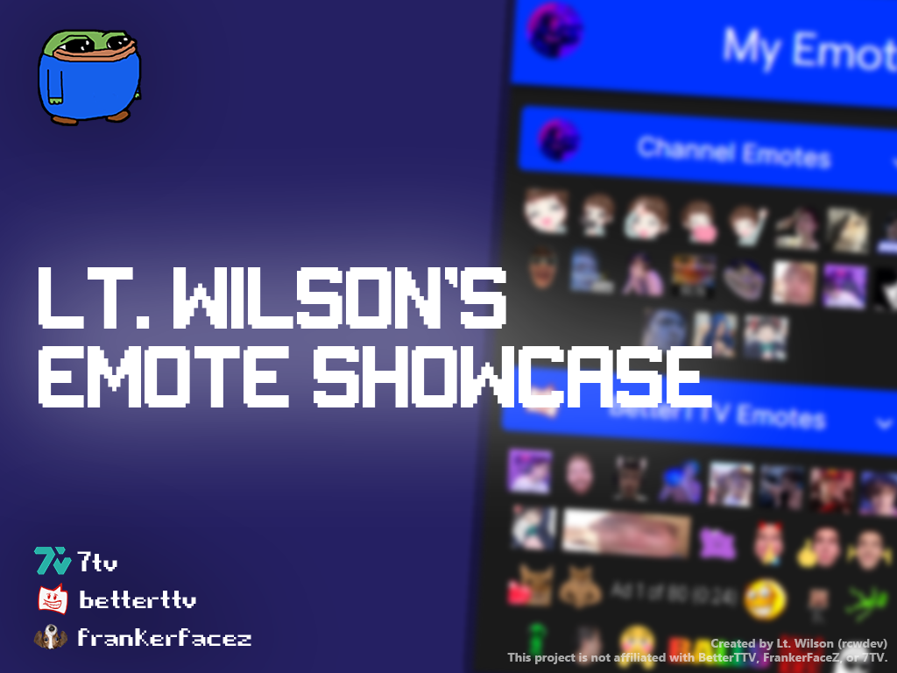

## About this project.

This project, publicly speaking, is one of my biggest and most successful projects I've ever made. The Emote Showcase was a customizable [Twitch extension](https://dashboard.twitch.tv/extensions) that allowed broadcasters to quickly display all of the available emotes on their channel. Including support for third-party emote services like BetterTTV, FrankerFaceZ, and 7TV.

The biggest selling point was the customization. You could adapt the color palette of almost every element to better match your channel's aesthetic.

## It was quite successful.

In it's lifetime, the extension ended up being very popular, becoming one of the top 30 most used Twitch extensions on the platform.

Cumulatively, the extension amassed the following over more than two years of being available:

- **27,843** broadcasters across Twitch installed it.
- **23,124** activations, or people who actually took the time to configure it to their liking.
- **17,432,793** unique viewers. That's UNIQUE Twitch accounts that interacted with the extension at any point.

## So, what happened to it?

I made this project while I was still ~15 or 16 in high school. The long and short of it was that I was too busy with school work to work on a publicly facing project.

And the reality is, the project was poorly designed from the get-go. Instead of using an easier to maintain framework like React or Svelte, the Emote Showcase was written **entirely** in raw HTML, CSS and JavaScript. Which made it a significant chore to maintain.

Combining those two problems, I ended up retiring the extension altogether so that I could focus on life.